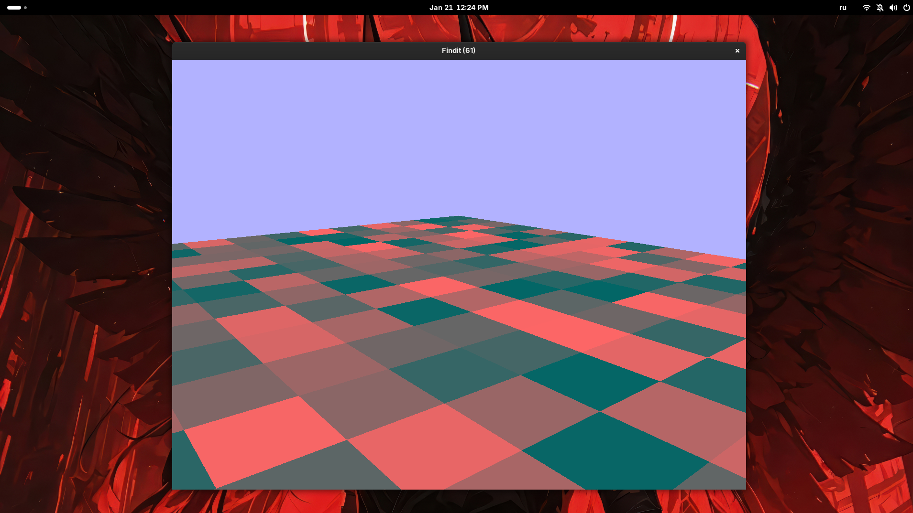

# findit
<div align="center">
  
</div>

**Воксельный движок на C++** - экспериментальный проект для изучения воксельных чанков, рендеринга и оптимизации видимости.

## Что это
Простая воксельная песочница с чанками 16x16x16. Генерирует случайные кубы, реализует проверку видимости (culling скрытых граней), рендерит через OpenGL. Пока tech demo - база для будущей игры.

## Используемые технологии
- **C++17** - основа движка
- **OpenGL 3.3+** - рендеринг кубов (VAO/VBO)
- **GLM** - векторная математика, трансформации
- **GLEW** - загрузка OpenGL функций
- **SDL** - окно и ввод

## Особенности реализации
┌─────────────────────────────────────┐
│ Чанк 16³ → 4096 вокселей            │
│ ✓ Генерация позиций + цвет          │
│ ✓ Culling по соседям (ivec3 hash)   │
│ ✓ Индивидуальные матрицы model      │
│ ✗ Greedy meshing / освещение        │
└─────────────────────────────────────┘

## Управление
- **WASD** - движение
- **Мышь** - обзор
- **Esc** - выход

## Сборка (Linux)
```bash
git clone https://github.com/mental0-main/findit.git && cd findit
mkdir build && cd build
cmake ..
make -j$(nproc)
./findit
```

**Статус:** Проект на паузе. Основа готова.~ 
**Планы:** мир из чанков, текстуры, освещение.~

[](https://github.com/mental0-main)~
